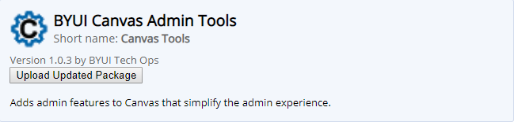

# BYUI Canvas Admin Tools
## Purpose
Enables various features to Canvas that aren't available by default.
This includes features such as:
  - Deleting all quizzes or just the quiz questions within a specific quiz
  - Locking and unlocking all blueprint items
  - Adding the correct DIV to the course's html files
  - Displaying section number(s), module navigation bar, and other navigation features
  - And lots more!

## Development
### Implementation
If a user is logged in with their school email google account they should be able to go to the chrome extension store and it will be right there.

### Updating
This will contain features on how to work on, update, and organize the app.
#### Adding a new button to the extension popup:
  1. Create file with desired logic within the *scripts* folder
  2. Update the **manifest.json** with that file's name, based on where it'll be used (e.g. "https://\*.instructure.com/courses/\*/quizzes" if you were only going to be running this script on the quizzes page)
  3. Add a button to the **popup.html** (wrap it in a label similar to the others)
     * Ensure the button and the label have separate IDs
  4. Add it (in object form) to the list of features located in **options.json**
     * Add an id, title, description, and type
     * type entails whether it's a button pressed in the popup ('popup')
     * if you just want it to run in the background put 'display as the type
  5. Add logic to **main.js**
     * First add to the chrome.storage.sync.get the name of the id you just created in the **options.json**
     * Set this to false
     * Make an if statement below that follows the pattern of the other statements
     * Add "document.querySelector(#[insert the name of the label you put on popup.html]).style.display = 'none'
  6. **Finally** add to the **messaging/listener.js**.
     * Add a 'case' with the name of the **button ID** to the switch statment
     * Add the function it will be calling (this function will be located in your logic/file that you made)
     * Add a sendResponse with a string saying what it successfully did (this is for the callback)

#### Updating the tool in Chrome Extention Store:
(_Note - Be sure to increment the project version number before updating_)
  1. Sign in to the account **technicaloperations@byui.edu** on Chrome
  2. Navigate to the Chrome Extention Store [here](https://chrome.google.com/webstore/category/for_your_domain)
  3. Click on the settings icon at the top left of the page. A dropdown menu will appear
  4. Select _development dashboard_. A list of extensions will appear
     * Select the 'Edit' link on the BYUI Canvas Admin Tools extention
  
  5. Compress the entire project folder into a .zip and upload it using the 'Upload Updated Package' button
  
