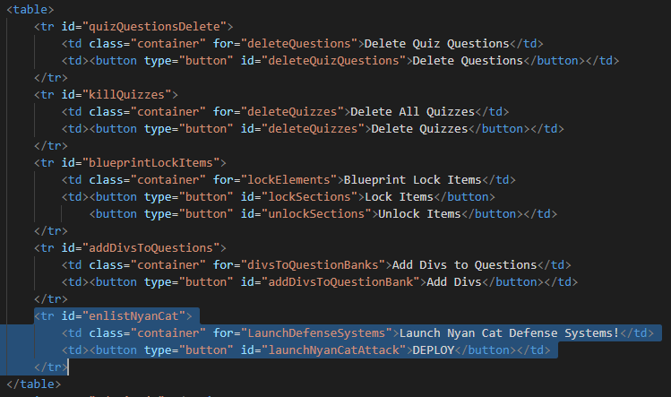
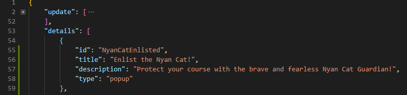

# How to Add a Custom Feature to the Extension Popup
## Create a Subfolder For Your Script
  

The first thing you need to do is create a subfolder for your script in the extension's `scripts` folder. Create a file within that subfolder to house the code for your custom feature.

  

  Be sure to wrap your logic in its own function. We will invoke this function when the user presses the button in the popup.

  
  
  Once you have the logic nested within that function, navigate to the `manifest.json` file in the root folder. Find the `content_scripts` array and add the following snippet of code.
```json
{
    /* Replace this with an array of all the domains 
       you want your script to run on. The "*" symbol 
       is used as a wild card */
    "matches": [ "https://*.instructure.com/*"],
    "js": [/*PATH TO THE JS FILE(s) YOU JUST CREATED*/]
}
```
Adding this to the manifest tells the extension where to inject your script into the page. the `matches` attribute tells chrome which domains to run your script on. You can list as many domain as you would like. You can use "*" as a wild card for these domains. The `scripts` attribute tells the extension what scripts to run when you get to that page. By adding the file you made with your custom function to this list, you make your function avaliable to the popup later on. 

  
  Once you add your script file to the manifest, we need to add your button to the popup menu. To do this, open the `popup.html` in the root folder. Scroll down to the table and add the following snipet of code to the list.

  ```html
  <tr id="FEATURE_ID">
      <!-- This describes what your button does -->
    <td class="container" for="FUNCTION_NAME">BUTTON DESCRIPTION GOES HERE</td>
    <!-- This button invokes the function which has your special feature code -->
    <td><button type="button" id="BUTTON_ID">BUTTON LABEL GOES HERE</button></td>
   </tr>
  ```
Once you have added this code to the table, be sure to write down the `FEATURE_ID` and the `BUTTON_ID` which you created. Remember that these two Ids need to be different. You will be using them later on in the code. 
  
  

Once you have added this code to the HTML file, navigate to the `options.json` in the root folder. This is where we add the code for enabling / disabling your code in the extensions options menu. Scroll down to the `details` array and add the following snipet of code.

```json
{
    "id": "OPTION_ID",
    "title": "TITLE OF YOUR FEATURE FOR THE OPTIONS PAGE",
    "description": "DESCRIBE YOUR CUSTOM FEATURE IN DEPTH!",
    "type": "popup"
}
```