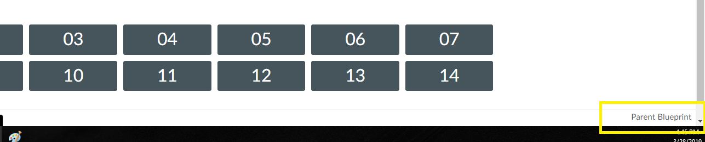

# Project Capture Document for Extension: Add Blueprint Parent
#### *Author: Theron Dowdle*
#### *Stakeholder(s): Corey Moore and Team*
#### *Date: 3/28/19*


## Background

Corey would have to go from a child course to its parent blueprint, but there was no easy way to find the parent course.  He requested to have a link appear that could take you there.

<!-- 

Explain the context of the problem.
Explain key terms/words, words that may be unfamiliar to a new hire.


Do Example: 
    
    Corey and his team have been manually going through the html for all images in canvas and filling in the alt attribute. This has been very time consuming. 
    - Alt image text, also called "image alt text", or just "alt text", is the text that appears on html pages if the image fails to load.

Don't Example:

-->

-----

## Definition of Done

This tool will add a link to each course that takes you to the blueprint parent of that course.

<!-- 

What is/are the project outcome(s)?
("Can you give me one sentence describing what you want done?")
We are trying to clean up the yard by Mow, Edge, and Rake.

Do Example:

    We are creating a tool to find all images that are in need of alt text in canvas which will automate this process by showing an image and prompting for alt text.

Don't Example:

-->


-----

# Requirements

### General Requirements

### Input Requirements

#### Definition of Inputs

* The manifest.json dictates which urls will allow this tool to run

```JSON
        {
            "matches": [
                "https://*.instructure.com/courses/*"
            ],
            "js": [
                "addBlueprintParent.js",
            ]
        }
```

No other direct user input.  
They select if the tool is enabled on the options page, and it runs on the page load.

<!-- List here a type definition for each input. For example, if it is a CSV define the column names. If it is a JSON, give an example of the JSON structure. If it is user input, what will the user be asked for? -->

#### Source of Inputs

* Manifest.json for the url(s) that will allow the tool to be run
* Gets the ID of the course through the URL, which it then uses to find the parent course

<!-- Paragraph of how to get inputs. From who? From where: Slack, email, server...? This also includes user selected options at runtime. How will we know what options to select? For example, in conversion tool, you'd follow the values on the Trello Board. It would also include the steps to get access to the information you need, such as getting added to a Trello Board, or access to a server. -->

---

### Output Requirements

#### Definition of Outputs

Adds a `div` to the bottom of the user's instance of the web page that contains a link to the parent course

<!-- List here a type definition for each output? For example, if the changes are directly to the LMS, list all changes that occur. If it is a CSV define the column names. If it is a JSON, give an example of the JSON structure. -->

#### Destination of Outputs

Directly on the user's instance of the webpage.

<!-- Paragraph where/who to send outputs. To who? To where: Email, server, directly to LMS...? It would also include the steps to get access to the locations you need, such as getting added to a Trello Board, or access to a server, or the LMS. -->

---

### User Interface

#### Type:

Adds a DOM element to Canvas



<!-- CLI with Flags, CLI With Prompt, Web Page, Server, Library, etc -->

<!-- What are the flags, what are Major Questions, Images of UX/UI Design. -->

-----

## Expectations

### Timeline: Done

<!-- Include Milestone List here with Deadlines and try to make each milestone a minimum viable product
- Milestone 1: Finish Design (3/19)
- Milestone 2: Build Core logic to search for words in syllabi (3/22)
- Milestone 3: Connect inputs to core logic and set up outputs (3/25)
- Milestone 4: Deliver the project (3/26)
This will probably be overkill for small projects -->

### Best Mode of Contact: Slack/Email

### Next Meeting: N/A


### Action Items
<!-- Recap Meeting -->
#### TechOps
#### Stakeholder

-----

#### *Approved By:* Aaron Shiffler
#### *Approval Date:* 03 April 2019