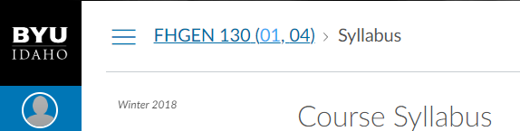

# Project Capture Document for Extension: Breadcrumb Course Sections
#### *Author: Theron Dowdle*
#### *Stakeholder(s): Corey Moore and Team*
#### *Date: 3/29/2019*

## Background

Corey and his team requested a tool that would allow them to see all sections that were enrolled in a course, and that would somehow distinguish the cross-listed sections.

-----

## Definition of Done

This tool will add some text to the end of the breadcrumb that will show all sections of a course, and have blue text for the cross-listed sections 

-----

# Requirements

### General Requirements

### Input Requirements

#### Definition of Inputs

No user input

<!-- List here a type definition for each input. For example, if it is a CSV define the column names. If it is a JSON, give an example of the JSON structure. If it is user input, what will the user be asked for? -->

#### Source of Inputs

No user input
Get the sections through the Canvas API: `https://byui.instructure.com/api/v1/courses/${courseID}/sections`

<!-- Paragraph of how to get inputs. From who? From where: Slack, email, server...? This also includes user selected options at runtime. How will we know what options to select? For example, in conversion tool, you'd follow the values on the Trello Board. It would also include the steps to get access to the information you need, such as getting added to a Trello Board, or access to a server. -->

---

### Output Requirements

#### Definition of Outputs

Add a part to the course code in the breadcrumb that contains all sections of that course. Cross-listed sections will have blue text.

<!-- List here a type definition for each output? For example, if the changes are directly to the LMS, list all changes that occur. If it is a CSV define the column names. If it is a JSON, give an example of the JSON structure. -->

#### Destination of Outputs

Directly on the web page

<!-- Paragraph where/who to send outputs. To who? To where: Email, server, directly to LMS...? It would also include the steps to get access to the locations you need, such as getting added to a Trello Board, or access to a server, or the LMS. -->

---

### User Interface

#### Type:

Add a small piece on Canvas.

<!-- CLI with Flags, CLI With Prompt, Web Page, Server, Library, etc -->

<!-- What are the flags, what are Major Questions, Images of UX/UI Design. -->

-----

## Expectations

### Timeline: Done

<!-- Include Milestone List here with Deadlines and try to make each milestone a minimum viable product
- Milestone 1: Finish Design (3/19)
- Milestone 2: Build Core logic to search for words in syllabi (3/22)
- Milestone 3: Connect inputs to core logic and set up outputs (3/25)
- Milestone 4: Deliver the project (3/26)
This will probably be overkill for small projects -->

### Best Mode of Contact: Slack/email

### Next Meeting: N/A

### Action Items
<!-- Recap Meeting -->
#### TechOps
#### Stakeholder

-----

#### *Approved By:* 
#### *Approval Date:*